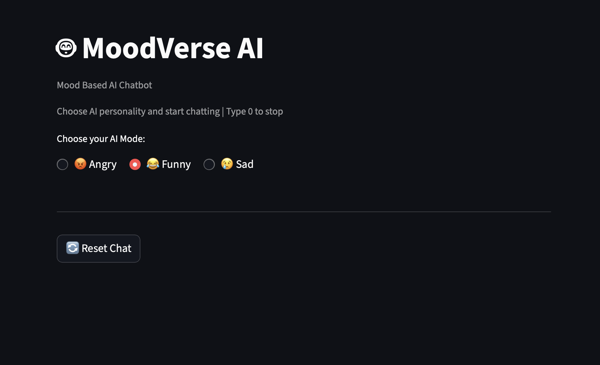
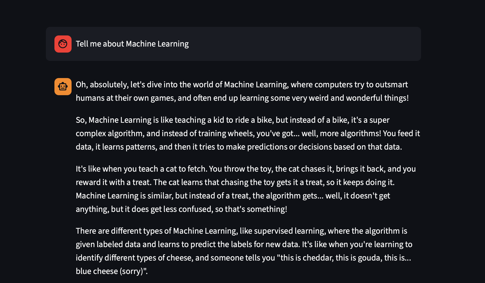

# 🤖 MoodVerse AI

MoodVerse AI is a mood-based conversational chatbot powered by Mistral AI, LangChain, and Streamlit. Chat with AI personalities that respond in different emotional tones, making every conversation unique and engaging.

## ✨ Features

- 😡 Angry Mode – Aggressive and impatient responses.
- 😂 Funny Mode – Humorous and joke-filled conversations.
- 😢 Sad Mode – Emotional and melancholic responses.
- 💬 Interactive chat interface built with Streamlit.
- 🧠 Session-based conversation memory.
- 🔄 Reset chat functionality.
- 🔐 Secure API key management using `.env`.

---

## 📸 Screenshots

### Home Interface



### Chat Conversation



---

## 🛠️ Tech Stack

- Python
- Streamlit
- LangChain
- Mistral AI
- python-dotenv

---

## 📂 Project Structure

```text
MoodVerse-AI/
│
├── UIchatbot.py
├── chatbot.py
├── .env
├── requirements.txt
├── ss1.png
├── ss2.png
└── README.md
```

---

## ⚙️ Installation

### Clone the Repository

```bash
git clone https://github.com/your-username/MoodVerse-AI.git
cd MoodVerse-AI
```

### Create a Virtual Environment

```bash
python -m venv venv
```

### Activate the Environment

**macOS/Linux**

```bash
source venv/bin/activate
```

**Windows**

```bash
venv\Scripts\activate
```

### Install Dependencies

```bash
pip install -r requirements.txt
```

---

## 🔑 Environment Variables

Create a `.env` file in the root directory and add your Mistral API key:

```env
MISTRAL_API_KEY=your_api_key_here
```

---

## 🚀 Run the Application

```bash
streamlit run UIchatbot.py
```

Open your browser and navigate to:

```text
http://localhost:8501
```

---

## 🎭 Available AI Modes

| Mode | Description |
|--------|-------------|
| 😡 Angry | Responds aggressively and impatiently |
| 😂 Funny | Responds with humor and jokes |
| 😢 Sad | Responds in an emotional and emotional tone |

---

## 💡 How It Works

1. Select an AI personality.
2. Enter your message.
3. The selected mood is sent as a system prompt.
4. Mistral AI generates responses based on the chosen personality.
5. Conversation history is maintained using Streamlit session state.

---

## 🔄 Reset Chat

Click the **Reset Chat** button to clear the conversation history and start a new chat session.

---

## 📦 Requirements

```txt
streamlit
langchain
langchain-core
langchain-mistralai
python-dotenv
```

